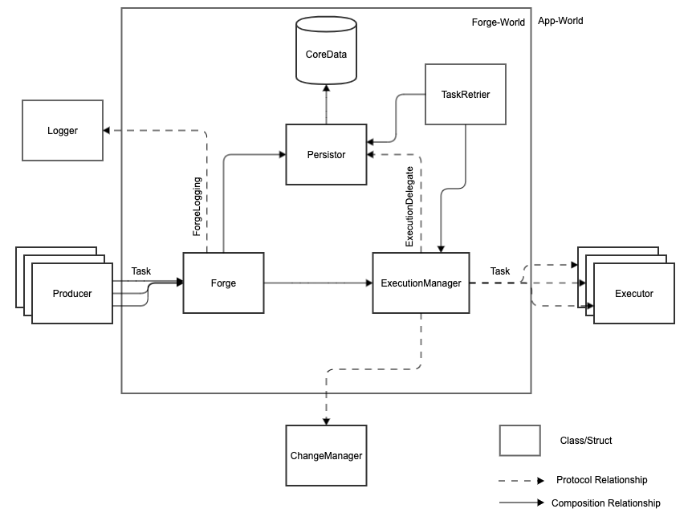

# Components

1. Within Forge-world (controlled by Forge's code)
2. Within App-world (controlled by app using Forge)

## Forge-World

### Forge
Entry class for Forge. Check Example in README to see how to use it.

### Persistor
Handles the persistence tasks for Forge.

Forge uses [Core data](https://developer.apple.com/library/archive/documentation/Cocoa/Conceptual/CoreData/index.html) for persisting tasks. It sets up the core data stack and gives relevant API to be used by `Forge` and `ExecutionManager`.

### ExecutionManager
Keeps a reference ot registered `Executor`s and handles the execution of tasks.

### TaskRetrier
All failed tasks with retriable errors are persisted by Forge. TaskRetrier checks for tasks that can be retried and executes them.

## App-World

### Task
Defines the abstraction for any work that can be submitted to `Forge`.

### Producer
Produces tasks to be executed and submits it to `Forge`.

### ChangeManager
Handles events to tasks as reported by `Forge`.

### Executor
Executes the `Task`.

# Execution

### Happy Path

1. App registers Executor `E` for type `t`.
2. Producer submits a task `T` of type `t`.
3. Persistor persists `T`.
4. ExecutionManager submits `T` to `E`.
5. ChangeManager is informed on all events.
6. `E` calls `completion` with success.
7. ChangeManager is informed on all events.
8. Persistor deletes `T`.

## Having Retriable Tasks

When `Executor` is called to execute a `Task`, it is passed `countOfRetries`. `countOfRetries` represents the number of times this task was passed to `Executor`.
`Executor` based on parameters in `Task`, `countOfRetries` decides to return any of the following states:

1. Success
2. Failure. Failure can be of two different kind:
	1. Retriable
	2. Non-Retriable

#### Retriable

In this case, ChangeManager is NOT told about task completion.

1. Conditional retries - based on n/w, disk etc
	* `countOfRetries` is NOT increased.
	* Consider the scenario of not having network at time of execution.
	* You want to retry the task because certain conditions weren't met.
2. Non Conditional retries
	* `countOfRetries` IS increased.
	* Consider that for the network task, server responds with `500` status code and you want to retry after some time.

#### Non-Retriable

In this case, ChangeManager IS told about task completion.

* Task failed which can not be retried.
* Consider the case that countOfRetries is now more than 10. You may want to fail the task and show the user error message instead of keeping on trying.
* Remove the task from persistence and fail the task.

Note: Executor is expected to keep a check on countOfRetries and give a Non-Retriable fail at some point. Otherwise the task would forever be stuck in retrying.

# Debugging

Check [debugging](debugging.md)
