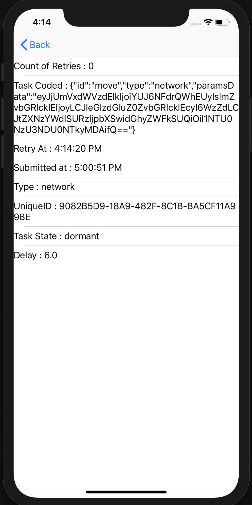

# Debugging

* We now have a view that you can add to your app to see all tasks with their state.
* The ForgeTasksViewController presents all the current tasks residing in Forge in a color coded manner.
* The color coding scheme :
	* Red denotes Dormant
	* Green denotes Executing
	* Yellow denoted Unknown
* Each task is shown in a concise manner within a cell with its essential details upfront.

* If one wants to view a particular task in a more detailed manner, then on tapping on the task's cell another view is presented which contains some additional information.

